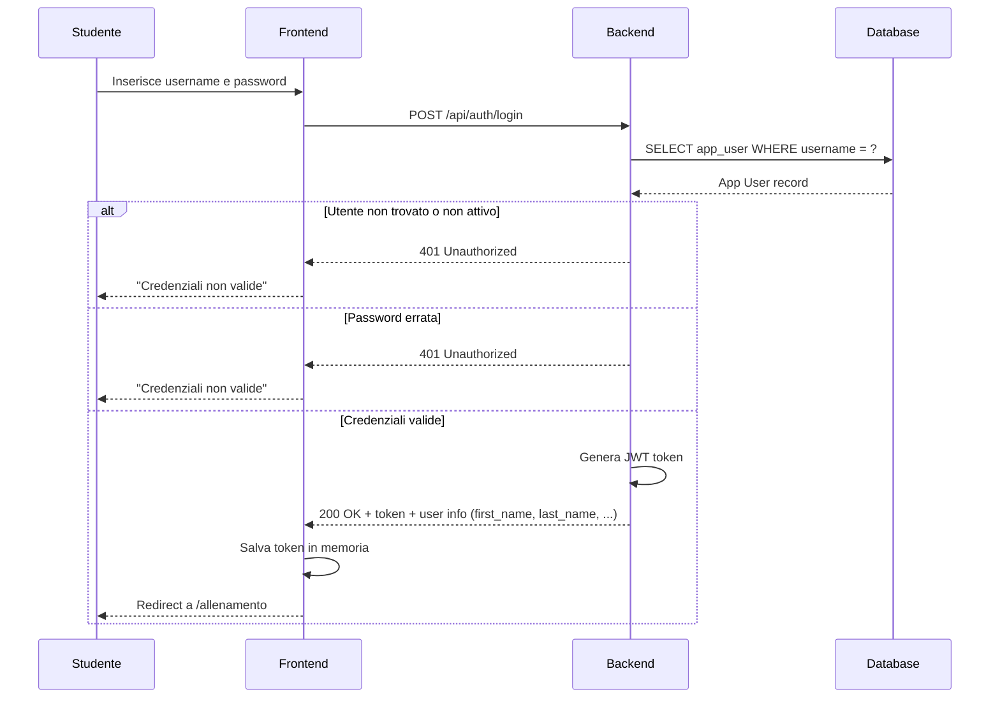
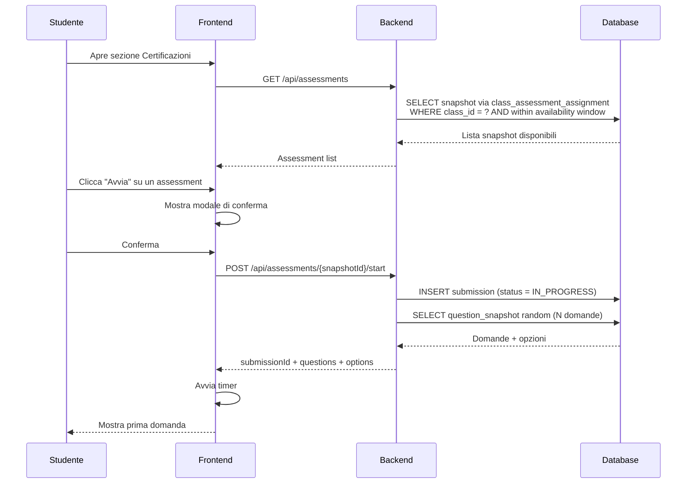
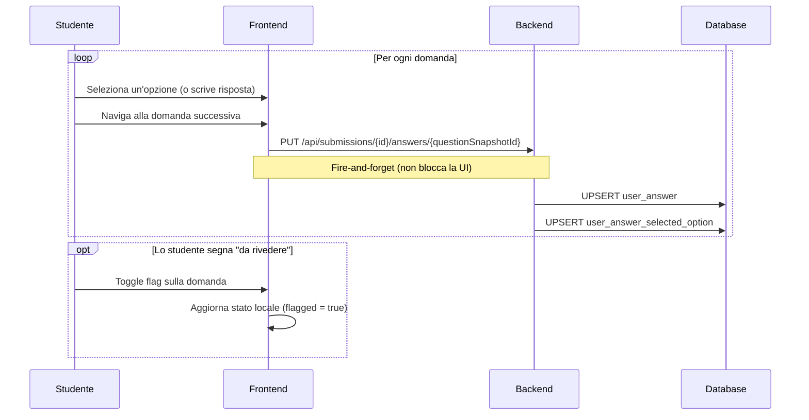
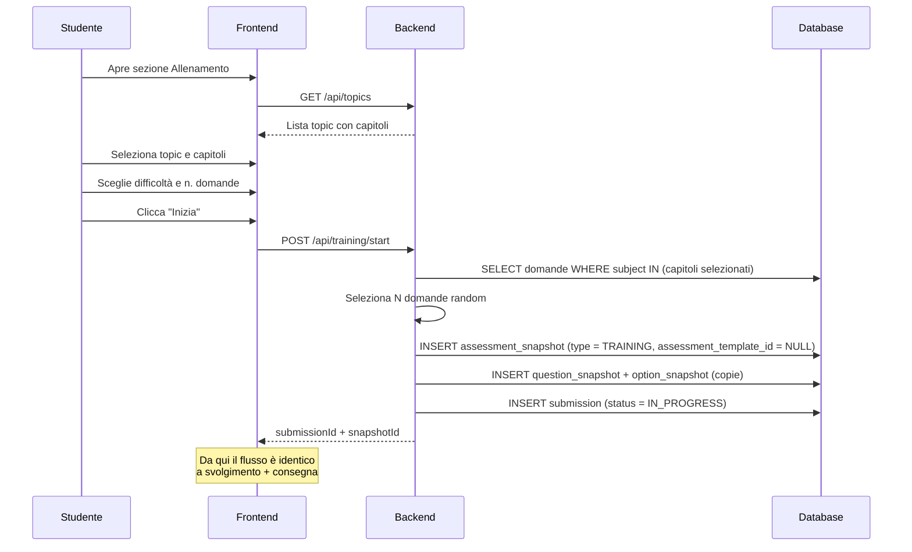
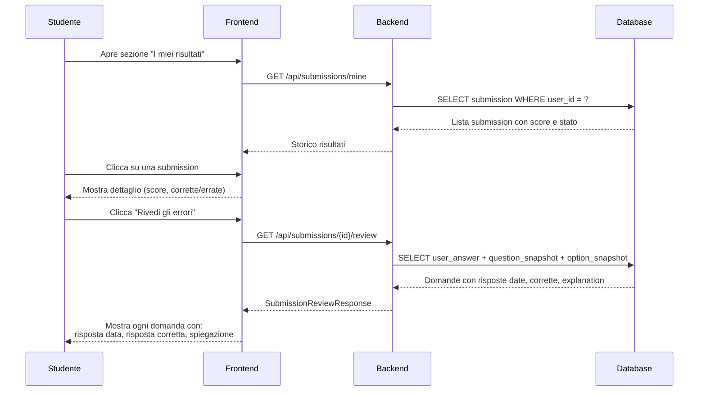

# Funzionalità di Sistema — Testero

Questa pagina documenta le funzionalità principali del sistema con diagrammi di sequenza.

---

## Autenticazione

<h3 style={{display: 'inline'}}>Login</h3>

**Entità coinvolte:** **App User**, **App User Role**, **App Role**

Il sistema verifica in ordine:

1. L'utente esiste? (lookup per `username` o `email`)
2. L'account è attivo? (`is_active = true`)
3. La password è corretta? (bcrypt match)
4. Deve cambiare password? (`must_change_password` o `password_expires_at` scaduto)

Se deve cambiare password, il BE genera un token limitato che permette solo `POST /api/auth/set-password`.

---

## Assessment

<h3 style={{display: 'inline'}}>Avvio assessment (CERT_SIMULATION / EXAM)</h3>

**Entità coinvolte:** **Class Assessment Assignment**, **Assessment Snapshot**, **Question Snapshot**, **Option Snapshot**, **Submission**

Il sistema:
1. Mostra solo gli assessment assegnati alla classe dello studente e dentro la finestra di disponibilità
2. Alla conferma, crea una **Submission** con stato `IN_PROGRESS`
3. Estrae N domande random dal pool dello snapshot (`questions_per_assessment`)
4. Avvia il timer del FE (basato su `timer_minutes` dello snapshot)

---

<h3 style={{display: 'inline'}}>Svolgimento e salvataggio risposte</h3>

**Entità coinvolte:** **Submission**, **User Answer**, **User Answer Selected Option**, **Question Snapshot**, **Option Snapshot**

Il salvataggio è **incrementale e in background**: ogni volta che lo studente cambia domanda, il FE invia la risposta corrente al BE senza bloccare la navigazione. Se la connessione cade, le risposte già inviate sono salve nel DB.

I campi `is_correct` e `points_awarded` sulla **User Answer** restano NULL durante lo svolgimento — vengono calcolati solo alla consegna.

---

<h3 style={{display: 'inline'}}>Consegna e scoring</h3>

```mermaid
sequenceDiagram
    participant S as Studente
    participant FE as Frontend
    participant BE as Backend
    participant DB as Database

    alt Consegna manuale
        S->>FE: Clicca "Consegna"
        FE->>FE: Mostra modale di conferma
        S->>FE: Conferma
    else Timer scaduto
        FE->>FE: Timer raggiunge 0
        FE->>FE: Redirect automatico a recap
    end

    FE->>BE: PUT /api/submissions/{id}
    BE->>BE: Imposta status = SUBMITTED (o AUTO_CLOSED)
    BE->>BE: Imposta submitted_at = now()

    loop Per ogni User Answer
        BE->>DB: SELECT option_snapshot WHERE is_correct = true
        BE->>BE: Confronta con opzione selezionata
        alt Risposta corretta
            BE->>DB: UPDATE user_answer SET is_correct = true, points_awarded = pts_correct
        else Risposta errata
            BE->>DB: UPDATE user_answer SET is_correct = false, points_awarded = pts_wrong
        else Non risposta
            BE->>DB: UPDATE user_answer SET is_correct = false, points_awarded = pts_unanswered
        end
    end

    BE->>BE: score = SUM(points_awarded)
    BE->>DB: UPDATE submission SET score = ?, status = ?
    BE-->>FE: SubmissionFeedbackResponse (score, dettagli)
    FE-->>S: Pagina risultati
```

**Entità coinvolte:** **Submission**, **User Answer**, **User Answer Selected Option**, **Option Snapshot**, **Assessment Snapshot**

Il punteggio è calcolato interamente dal server:
- Per ogni domanda, confronta l'opzione selezionata con `is_correct` sull'**Option Snapshot**
- Assegna `pts_correct`, `pts_wrong` o `pts_unanswered` (dallo snapshot)
- Se la domanda ha `points` personalizzati, quelli sovrascrivono `pts_correct`
- Il `score` sulla **Submission** è la somma di tutti i `points_awarded`

Il risultato è **irreversibile**: una volta consegnato, lo stato non torna a `IN_PROGRESS`.

---

<h3 style={{display: 'inline'}}>Training (pratica libera)</h3>

**Entità coinvolte:** **Topic**, **Topic Subject**, **Subject**, **Question Template Subject**, **Assessment Snapshot**, **Question Snapshot**, **Option Snapshot**, **Submission**

La differenza rispetto a CERT_SIMULATION/EXAM:
- Lo snapshot viene creato **dinamicamente** al momento dell'avvio, non da un publish del docente
- `assessment_template_id` è **NULL** (nessun template padre)
- `type = TRAINING`
- `timer_minutes = 0` (nessun timer, a meno che lo studente lo attivi nel configuratore)
- Non c'è esito formale (superato/non superato)

---

<h3 style={{display: 'inline'}}>Visualizzazione risultati e ripasso</h3>

**Entità coinvolte:** **Submission**, **User Answer**, **User Answer Selected Option**, **Question Snapshot**, **Option Snapshot**, **Question Snapshot Subject**

Il ripasso mostra per ogni domanda:
- Il testo della domanda e le opzioni (dallo snapshot)
- Quale opzione ha selezionato lo studente
- Quale era la risposta corretta
- La spiegazione didattica (`explanation` dal **Question Snapshot**)
- Gli argomenti della domanda (dal **Question Snapshot Subject**) per il breakdown per argomento

---
