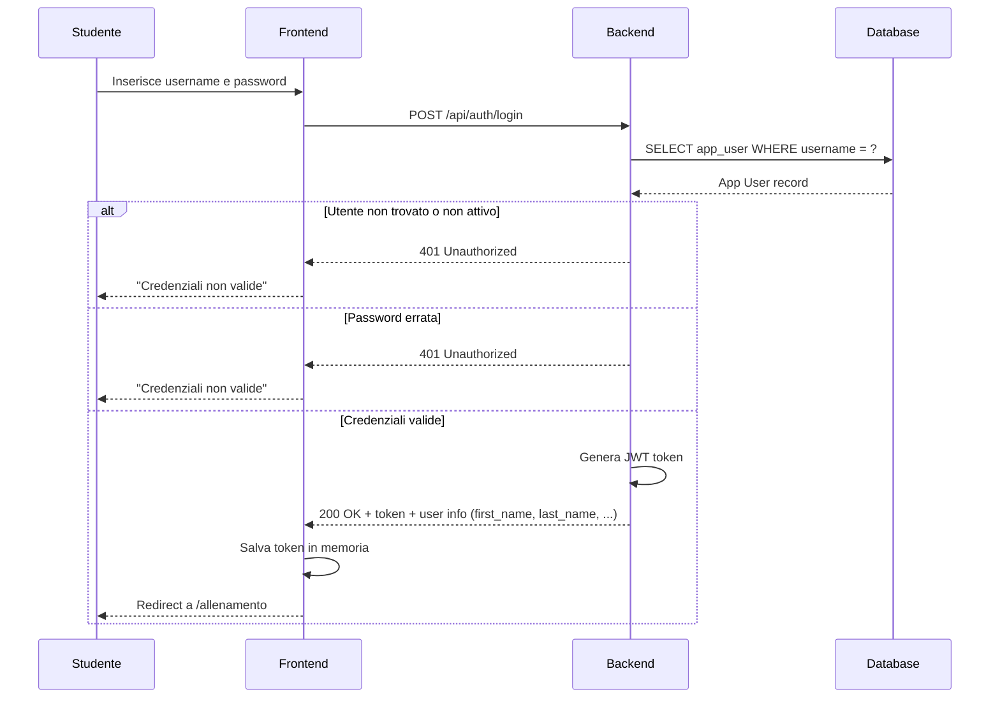
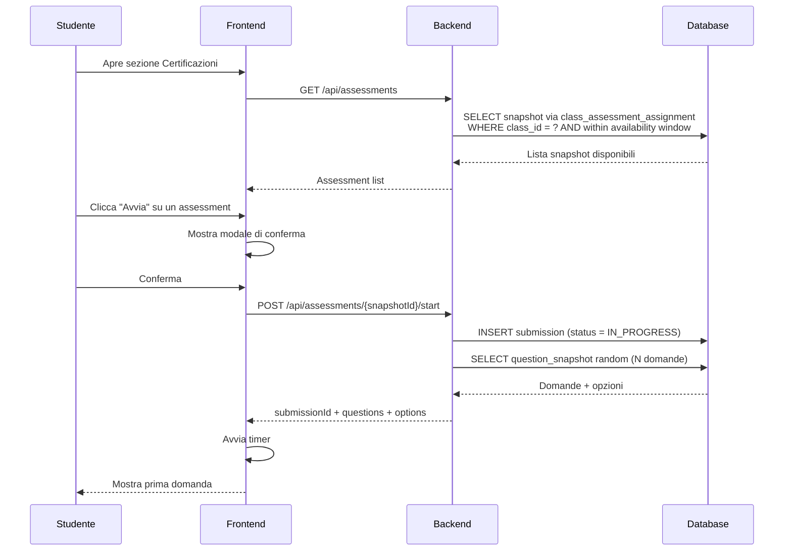
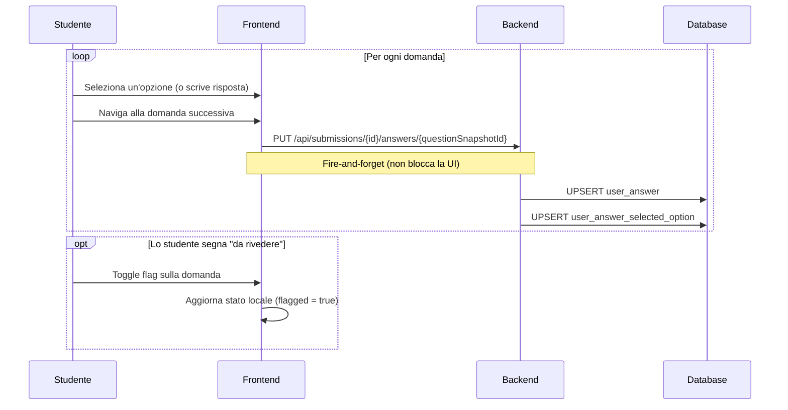
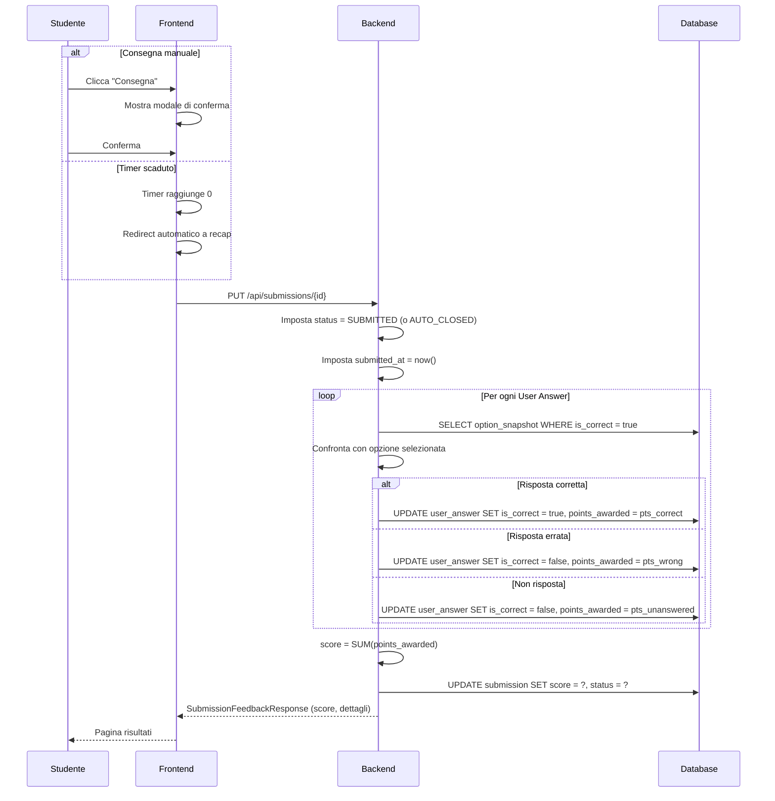
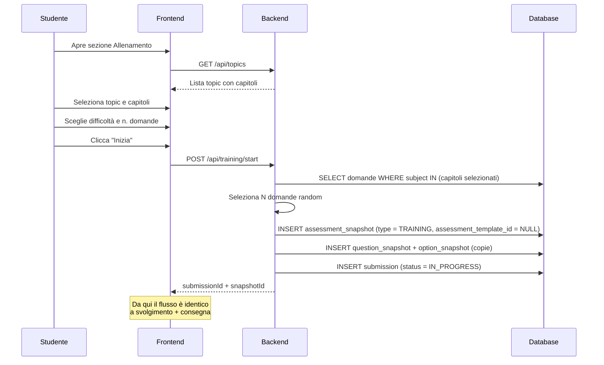
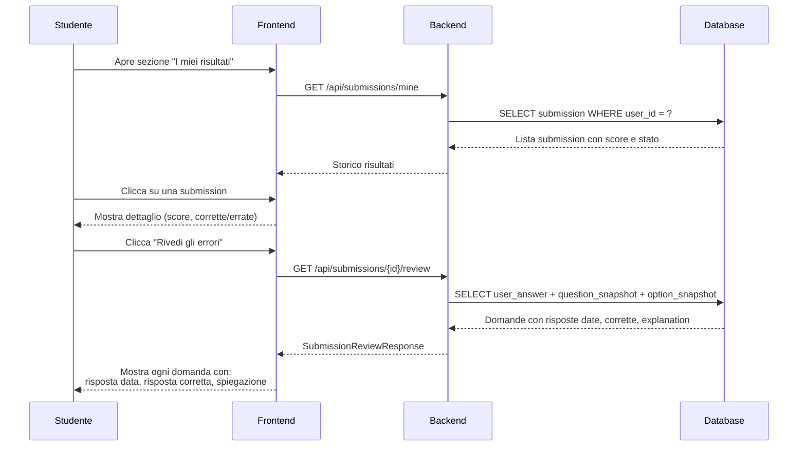
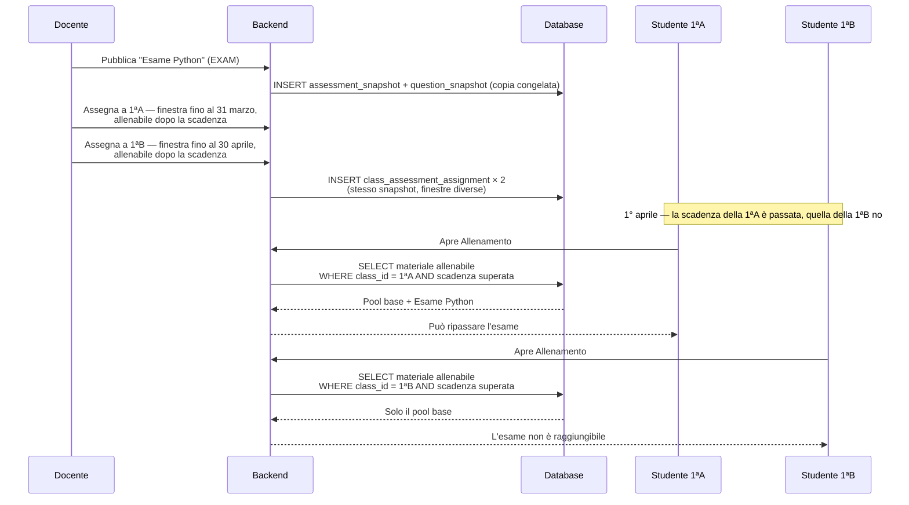
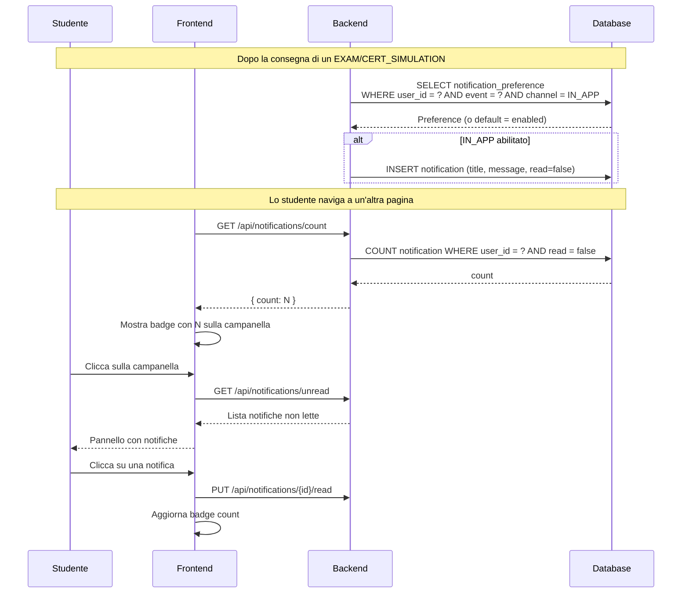
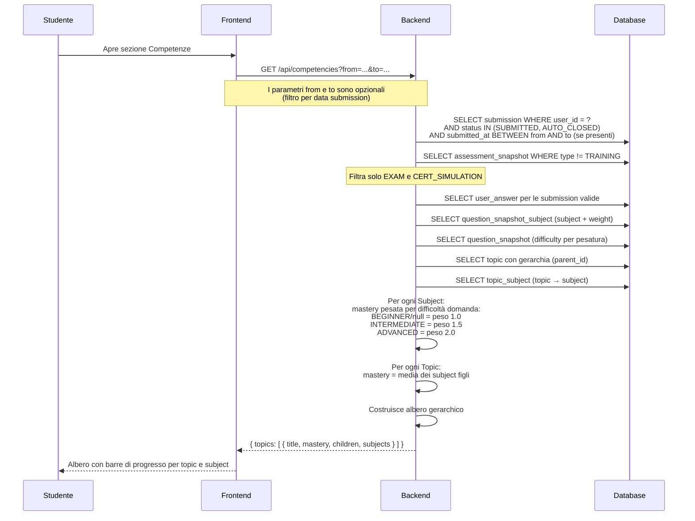

# Funzionalità di Sistema — Testero

Questa pagina documenta le funzionalità principali del sistema con diagrammi di sequenza.

---

## Autenticazione

<details>
<summary><h3 style={{display: 'inline'}}>Login</h3></summary>



**Entità coinvolte:** **App User**, **App User Role**, **App Role**

Il sistema verifica in ordine:

1. L'utente esiste? (lookup per `username` o `email`)
2. L'account è attivo? (`is_active = true`)
3. La password è corretta? (bcrypt match)
4. Deve cambiare password? (`must_change_password` o `password_expires_at` scaduto)

Se deve cambiare password, il BE genera un token limitato che permette solo `POST /api/auth/set-password`.

</details>

---

## Assessment

<details>
<summary><h3 style={{display: 'inline'}}>Avvio assessment (CERT_SIMULATION / EXAM)</h3></summary>



**Entità coinvolte:** **Class Assessment Assignment**, **Assessment Snapshot**, **Question Snapshot**, **Option Snapshot**, **Submission**

Il sistema:
1. Mostra solo gli assessment assegnati alla classe dello studente e dentro la finestra di disponibilità
2. Alla conferma, crea una **Submission** con stato `IN_PROGRESS` e ne fissa il `seed` di randomizzazione
3. Estrae N domande random dal pool dello snapshot (`questions_per_assessment`), usando il `seed` della submission: l'estrazione e il mescolamento sono deterministici, quindi al reload lo studente ritrova lo stesso compito
4. Avvia il timer del FE (basato su `timer_minutes` dello snapshot)

</details>

---

<details>
<summary><h3 style={{display: 'inline'}}>Svolgimento e salvataggio risposte</h3></summary>



**Entità coinvolte:** **Submission**, **User Answer**, **User Answer Selected Option**, **Question Snapshot**, **Option Snapshot**

Il salvataggio è **incrementale e in background**: ogni volta che lo studente cambia domanda, il FE invia la risposta corrente al BE senza bloccare la navigazione. Se la connessione cade, le risposte già inviate sono salve nel DB.

I campi `is_correct` e `points_awarded` sulla **User Answer** restano NULL durante lo svolgimento — vengono calcolati solo alla consegna.

</details>

---

<details>
<summary><h3 style={{display: 'inline'}}>Consegna e scoring</h3></summary>



**Entità coinvolte:** **Submission**, **User Answer**, **User Answer Selected Option**, **Option Snapshot**, **Assessment Snapshot**

Il punteggio è calcolato interamente dal server:
- Per ogni domanda, confronta l'opzione selezionata con `is_correct` sull'**Option Snapshot**
- Assegna `pts_correct`, `pts_wrong` o `pts_unanswered` (dallo snapshot)
- Se la domanda ha `points` personalizzati, quelli sovrascrivono `pts_correct`
- Il `score` sulla **Submission** è la somma di tutti i `points_awarded`

Insieme allo `score`, la risposta contiene i due valori che completano l'esito:

| Campo | Come viene calcolato |
|---|---|
| `max_score` | Somma dei `points` dei **Question Snapshot effettivamente estratti** per quella submission; per le domande senza `points` vale `pts_correct` dello snapshot |
| `passed` | `score >= passing_score` dell'**Assessment Snapshot**; è `null` se lo snapshot non definisce una soglia |

:::caution Pool ≠ compito estratto
L'**Assessment Snapshot** contiene l'intero *pool* di domande, mentre ogni
submission ne estrae `questions_per_assessment` (estrazione congelata dal `seed`
della submission). Tutto ciò che misura una singola submission — `max_score` e
l'elenco del ripasso — va calcolato sulle domande estratte, non sul pool.

Le domande estratte si ricavano dalle **User Answer** della submission: ne
esiste una per ogni domanda somministrata, comprese quelle lasciate in bianco.
Usare il pool produce un massimo gonfiato (es. 21/67 invece di 21/35) e un
ripasso che mostra domande mai viste dallo studente.
:::

Esiste un'unica eccezione: quando la lista dei **Question Snapshot** non è
disponibile, `max_score` ricade sull'approssimazione
`questions_per_assessment × pts_correct`. È una stima corretta solo se nessuna
domanda ha `points` personalizzati, quindi va usata solo come ultima risorsa.

**Il frontend non ricalcola nulla di tutto questo.** `score`, `max_score` e
`passed` vengono presi così come arrivano dal backend e solo formattati. La
soglia di superamento vive esclusivamente nell'**Assessment Snapshot**: il
client non ne conosce il valore e non deve dedurlo da rapporti tipo
"corrette/totali".

Il risultato è **irreversibile**: una volta consegnato, lo stato non torna a `IN_PROGRESS`.

</details>

---

<details>
<summary><h3 style={{display: 'inline'}}>Training (pratica libera)</h3></summary>



**Entità coinvolte:** **Topic**, **Topic Subject**, **Subject**, **Question Template Subject**, **Assessment Snapshot**, **Question Snapshot**, **Option Snapshot**, **Submission**

La differenza rispetto a CERT_SIMULATION/EXAM:
- Lo snapshot viene creato **dinamicamente** al momento dell'avvio, non da un publish del docente
- `assessment_template_id` è **NULL** (nessun template padre)
- `type = TRAINING`
- `timer_minutes = 0` (nessun timer, a meno che lo studente lo attivi nel configuratore)
- Non c'è esito formale (superato/non superato)

</details>

---

<details>
<summary><h3 style={{display: 'inline'}}>Visualizzazione risultati e ripasso</h3></summary>



**Entità coinvolte:** **Submission**, **User Answer**, **User Answer Selected Option**, **Question Snapshot**, **Option Snapshot**, **Question Snapshot Subject**

Lo storico (`GET /api/submissions/mine`) restituisce `score`, `max_score`,
`passed` e `subject_scores` calcolati con le stesse regole della consegna, così
che la stessa submission mostri lo stesso esito e lo stesso dettaglio per
argomento subito dopo averla consegnata e mesi dopo rivedendola dallo storico.
`total_questions`, `correct_count`, `wrong_count` e `unanswered_count` contano
invece le sole domande a risposta multipla, perché riguardano la correzione
automatica.

Essendo un endpoint di lista, il breakdown per argomento è calcolato in batch
per tutte le submission della pagina: il costo resta costante e non cresce con
il numero di risultati. Le submission le cui domande non hanno argomenti
associati espongono `subject_scores` vuoto.

Il ripasso copre **solo le domande estratte per quella submission**, non l'intero
pool dello snapshot, e per ognuna mostra:
- Il testo della domanda e le opzioni (dallo snapshot)
- Quale opzione ha selezionato lo studente
- Quale era la risposta corretta
- La spiegazione didattica (`explanation` dal **Question Snapshot**)
- Gli argomenti della domanda (dal **Question Snapshot Subject**) per il breakdown per argomento

</details>

---

## Flusso docente — creazione e assegnazione (in progetto)

> **Attenzione:** questa sezione descrive un disegno **non ancora implementato**. Oggi le
> prove e le assegnazioni si creano a mano via SQL, e l'allenamento pesca direttamente dal
> banco domande senza passare dagli snapshot pubblicati. Il progetto è tracciato in
> [testero-backend#246](https://github.com/testero-app/testero-backend/issues/246).

Il banco domande (`assessment_template` + `question_template`) è modificabile dal docente.
La **pubblicazione** ne produce una copia congelata — lo snapshot — che è ciò che gli
studenti svolgono. Gli snapshot esistono in tre tipi, già presenti nel modello:
`TRAINING` (pool di allenamento), `CERT_SIMULATION` ed `EXAM`.

Due principi reggono l'intero disegno:

1. **La separazione per classe non si ottiene duplicando gli snapshot**, ma con
   `class_assessment_assignment`: un pool, tante assegnazioni, ciascuna con la propria
   finestra di validità. Duplicare significherebbe correggere lo stesso refuso in più copie.
2. **La disponibilità per l'allenamento è una proprietà dell'assegnazione, non della prova.**
   È questo che rende impossibile lo spoiler fra classi che svolgono lo stesso esame in date
   diverse.

<details>
<summary><h3 style={{display: 'inline'}}>Pubblicazione, assegnazione e allenabilità</h3></summary>



Alla pubblicazione il docente sceglie la disponibilità per l'allenamento fra tre valori:

| valore | quando usarlo |
|--------|---------------|
| **mai** | verifica riservata |
| **subito** | pool di esercitazione |
| **dopo la scadenza** | default per verifiche ed esami |

Con un semplice sì/no la sicurezza dipenderebbe dal docente che ricorda di attivare il flag
al momento giusto; con **dopo la scadenza** come default, il caso pericoloso non è
raggiungibile.

</details>

<details>
<summary><h3 style={{display: 'inline'}}>Casi d'uso</h3></summary>

**Creazione**

| | Il docente… | Risultato |
|---|---|---|
| **C1** | scrive un pool di allenamento (capitolo, difficoltà, spiegazione) e pubblica | snapshot `TRAINING` |
| **C2** | scrive una verifica: timer, soglia, tentativi → pubblica | snapshot `EXAM` |
| **C3** | scrive una simulazione di certificazione → pubblica | snapshot `CERT_SIMULATION` |
| **C4** | importa domande da un pool esistente in una nuova prova | copia nel banco, da lì indipendenti |
| **C5** | corregge una domanda e ripubblica | nuovo snapshot; le sessioni già svolte restano sul precedente |
| **C6** | ritira una domanda | esce dalle estrazioni future, resta leggibile nei ripassi |

**Assegnazione**

| | Il docente… | Effetto |
|---|---|---|
| **A1** | assegna il pool di allenamento alla 1ªA, da subito, senza scadenza | la 1ªA si allena |
| **A2** | assegna lo stesso esame a 1ªA (marzo) e 1ªB (aprile) | due finestre, un solo snapshot |
| **A3** | spunta "allenabile dopo la scadenza" sull'assegnazione | la 1ªA ripassa dopo marzo, la 1ªB non prima di aprile |
| **A4** | non assegna un pool a una classe più indietro nel programma | invisibile per quella classe |
| **A5** | chiude la finestra o revoca l'assegnazione | la prova sparisce, lo storico delle submission resta |

**Studente**

| | |
|---|---|
| **S1** | vede solo ciò che è assegnato alla sua classe, nella finestra valida |
| **S2** | si allena scegliendo capitolo e difficoltà fra il materiale allenabile per lui |
| **S3** | ripassa una verifica già svolta, ora allenabile |
| **S4** | riapre una sessione passata e rivede risposte e spiegazioni |

</details>

---

## Notifiche

<details>
<summary><h3 style={{display: 'inline'}}>Notifiche in-app</h3></summary>



**Entità coinvolte:** **Notification**, **Notification Preference**, **Submission**, **Assessment Snapshot**

Le notifiche vengono generate dal server dopo il completamento di un assessment (non per training). Il FE non fa polling: carica il conteggio delle notifiche non lette ad ogni cambio pagina.

Il sistema controlla le **Notification Preference** dell'utente prima di creare la notifica. Se l'utente ha disattivato il canale IN_APP per quell'evento, la notifica non viene creata.

</details>

---

## Competenze

<details>
<summary><h3 style={{display: 'inline'}}>Mastery per argomento</h3></summary>



**Entità coinvolte:** **Submission**, **User Answer**, **Question Snapshot**, **Question Snapshot Subject**, **Subject**, **Topic**, **Topic Subject**

La pagina Competenze mostra la padronanza dello studente per argomento, calcolata dalle submission passate:

- Solo **EXAM** e **CERT_SIMULATION** contano — il **training** è escluso
- L'endpoint `GET /api/competencies` accetta i parametri opzionali `from` e `to` (date ISO) per filtrare le submission per intervallo temporale. Se omessi, considera tutte le submission
- La mastery per **Subject** è **pesata per difficoltà della domanda**: ogni risposta corretta contribuisce con un peso che dipende dal campo `difficulty` del **Question Snapshot** — `BEGINNER` o `null` = 1.0, `INTERMEDIATE` = 1.5, `ADVANCED` = 2.0. La formula è: `mastery = somma(peso delle corrette) / somma(peso di tutte) × 100`
- La mastery per **Topic** = media delle mastery dei subject figli
- I **Topic** sono organizzati in una gerarchia ad albero (es. *"Python"* → *"Fondamenti"* → subject)

Se lo studente non ha ancora completato nessuna verifica, la pagina mostra un messaggio invitandolo a completarne una.

</details>

---

## Convenzioni API

<details>
<summary><h3 style={{display: 'inline'}}>Paginazione</h3></summary>

Gli endpoint che restituiscono liste supportano la paginazione tramite query parameter:

| Parametro | Default | Descrizione |
|-----------|---------|-------------|
| `page` | 0 | Numero della pagina (zero-based) |
| `size` | 20 | Numero di elementi per pagina |

La risposta affianca alla lista un oggetto `pagination` con i metadati:

| Campo | Tipo | Descrizione |
|-------|------|-------------|
| `total_elements` | long | Numero totale di elementi |
| `total_pages` | int | Numero totale di pagine |
| `page` | int | Pagina corrente |
| `size` | int | Dimensione della pagina |

Esempio di risposta di `GET /api/assessments`:

```json
{
  "assessments": [ ... ],
  "pagination": {
    "total_elements": 42,
    "total_pages": 3,
    "page": 0,
    "size": 20
  }
}
```

Endpoint paginati: `GET /api/assessments` e `GET /api/submissions/mine`. Senza parametri restituiscono la prima pagina con 20 elementi, quindi la paginazione è retrocompatibile per i client già esistenti.

</details>

---
